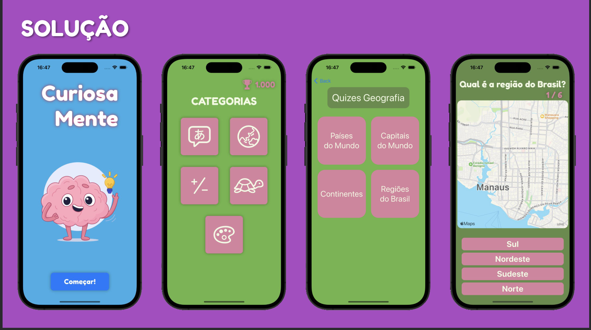
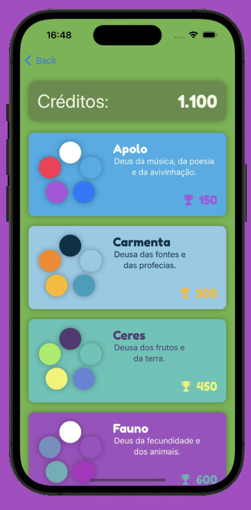

# Curiosamente

This repository contains a Swift app for conducting quizzes in the fields of geography, math, and text. The app provides an interactive platform for users to test their knowledge and improve their skills in these subjects.

The app was developed for a swift course HackaTruck.

It is currently not being developed because I no longer have acces to a plataform to develop in Swift, only had the oportunity to use a MacBook for a month.

## Features

- **Geography Quiz:** Test your knowledge of world geography with a wide range of questions covering continents, countries, capitals, landmarks, and more.
- **Math Quiz:** Challenge yourself with various math problems, including arithmetic, algebra, geometry, and logic puzzles.
- **Text Quiz:** Enhance your language skills by answering questions related to grammar, vocabulary, comprehension, and literary devices.
- **Theme Changer:** Change your theme based on the amount of points you got doing quizzes, gamefying the app and giving the user a incentive to play more and earn rewards.
## Screenshots

## Agradecimentos aos meu Colegas de Grupo

- David Dias Pinto
- Leonardo Henrique S. de Avelar
- Pedro Malta Boscatti
- Samuel Marques Souza Leal
